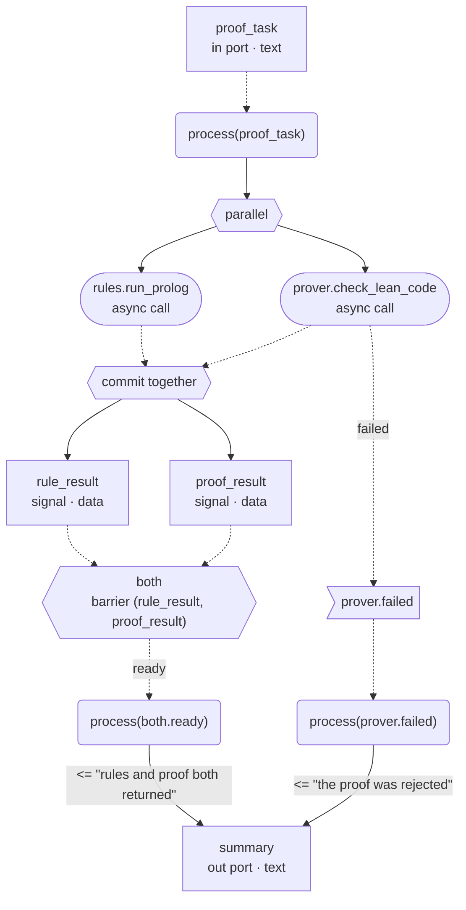

# Drawing AWHDL designs (`aic graph`)

English | [日本語](GRAPH_ja.md)

> The Japanese version is the normative (canonical) document. This English version is a reference translation; if they differ, the Japanese version prevails.

`aic graph` turns an AWHDL design that passes `aic check` into a human-readable diagram, for design
review, architecture explanation, debugging, security review, teaching and audit preparation. A diagram
is a **derived view** of the checked AST and does not define execution semantics; those are defined by
the [Runtime specification](RUNTIME_SPEC.md).

## Usage

```text
aic graph <file.awhdl>
    [--view structure|behavior|state|petri|security|activity]   default: structure
    [--format mermaid|dot|json|plantuml|pnml]                    default: mermaid
    [--output <path|->]                                 default: - (standard output)
    [--architecture <name>]      required when the file has several architectures
    [--show-classification]      show classifications on values and flows (always on in the security view)
    [--show-capabilities]        show device generics such as route
    [--show-policies]            show budgets and assertions (not in petri or activity)
    [--show-internal]            also show .done/.failed/.timeout that no process waits for
    [--compact]                  one-line labels; security-significant detail is kept
    [--no-lanes]                 do not draw the local/cloud lanes (boundaries)
    [--validate-only]            check and project only; write nothing
```

```bash
cargo run -p conductor-cli -- graph examples/tutorial/05_parallel_barrier.awhdl --view behavior
cargo run -p conductor-cli -- graph tests/graph/secure_development.awhdl --view security --format dot --output security.dot
dot -Tsvg security.dot -o security.svg   # with Graphviz installed
cargo run -p conductor-cli -- graph tests/graph/secure_development.awhdl --view activity --format plantuml --output activity.puml
cargo run -p conductor-cli -- graph tests/graph/secure_development.awhdl --view petri --format pnml --output net.pnml
```

Mermaid output can be pasted into Markdown (GitHub and others) as is. DOT converts to SVG or PDF with
Graphviz. JSON is the visualization IR described below, for future GUI or web viewers. PlantUML works for
the activity view (a UML activity diagram) only, and PNML (an ISO/IEC 15909-2 P/T net) for the petri view
only; Petri-net analysis tools can load the PNML.

## Exit status

| Value | Meaning |
|---|---|
| 0 | success |
| 1 | parse error (`AWHDL-E101`) |
| 2 | structural or profile error (`E2xx`, `E4xx`) |
| 3 | information-flow errors only (`E3xx`) |
| 4 | cannot be projected (`AWHDL-G401`, e.g. the state view or an ambiguous architecture) |
| 5 | the format cannot express the view (`AWHDL-G501`, e.g. the security view as PNML) |
| 6 | I/O error (unreadable input `AWHDL-E001`, unwritable output `AWHDL-E002`) |

A design that fails the check is not drawn. An invalid design is never drawn as if it were valid.

## Views

| View | Shows |
|---|---|
| `structure` | The entity boundary, ports (outside it), signals, timers and barriers (inside it), devices in a zone per location, and the main data flows. Flows leaving for the cloud are drawn thick |
| `behavior` | Processes, their triggers, asynchronous device calls, `if` branches, the `parallel` fork and its commit-together join, barriers, timers, timeouts, and `.done`/`.failed`/`.timeout` events. An edge that closes a cycle becomes `retry` (label `loop`) |
| `petri` | A P/T net with data abstracted. Places are small circles (a process woken, a point between statements, a parallel call running or finished, a barrier member), transitions are boxes (process start and end, assignments, call success, failure and timeout, branches, fork/join, timers, barriers), and every arc joins the two. Processes woken by input ports start with a token (●). An event reaches every process that waits for it by its own arc (explicit broadcast). `if` conditions and whether a write changes a value are choices, so every run of the design is a firing sequence of the net (an over-approximation), usable for reachability and safety analysis |
| `security` | Local and cloud zones, the orchestrator's signal store split into class groups, classified flows, cloud egress (also checked at runtime), human approval, and **denied flows**. A denial is a dotted edge labelled `DENIED` (`-.-x` in Mermaid; red, dotted, `tee` head in DOT), never an ordinary edge. When a denial covers a whole class group, it is drawn once from the group (JSON keeps one edge per value) |
| `activity` | A UML activity diagram with one activity per process and per barrier: start → accept the sensitivity events → actions (calls, assignments), `if` decisions and merges, `parallel` fork/join bars, a switch per call outcome → send signals for observed events → end. As in UML, activities connect through signal names |
| `state` | Declared states only. The v0.1 profile has no state types, so this view is currently always refused with exit status 4. States are never inferred |

Declassification (`x <= declassify e using d;`) is drawn in every view as the only place a class goes down: a
thick purple `declassified` edge in the security view, competing `granted` (light purple) and `refused`
transitions in the petri view, and a release action with a granted / refused switch in the activity view. See
`examples/secure_cooperation.awhdl` (a local LLM anonymizes, a check and a human release, a cloud AI analyzes).

The activity, petri and behavior views draw **lanes** (boundaries) from the device `location`: only calls of
cloud devices go into the `cloud (external)` lane, and everything the orchestrator runs goes into
`local (protected)`. PlantUML draws swimlanes, DOT and Mermaid filled frames, and edges crossing the boundary
are thick. A design with a single lane gets none.

Color never carries meaning alone; line style does: solid is synchronous data or control, dashed is
asynchronous or event-driven, thick is a checked boundary crossing (cloud egress, human approval), and a
dotted edge ending in `x` is denied.

`parallel` joins and barrier edges carry `generation_binding = (run_id, correlation_id, generation)`.
Results of different generations never satisfy the same join.

## Example (`examples/tutorial/05_parallel_barrier.awhdl`, behavior view)



## Visualization IR (`--format json`)

```json
{
  "graph_version": "0.1",
  "source_ir_version": "0.1",
  "view": "security",
  "entity": "secure_development",
  "architecture": "hybrid",
  "nodes": [
    {"id": "device:cloud_reviewer", "kind": "device",
     "label": ["cloud_reviewer", "agent · cloud", "clearance internal"],
     "source_ref": {"line": 15, "column": 5, "start": 598, "end": 706},
     "location": "cloud", "device_kind": "agent", "capabilities": {"route": "deep_reasoning"},
     "generation_sensitive": false, "metadata": {"clearance": "internal"}, "group": "zone:cloud"}
  ],
  "edges": [
    {"id": "security_flow:value:note->device:cloud_reviewer", "from": "value:note",
     "to": "device:cloud_reviewer", "kind": "security_flow",
     "label": "public · cloud egress (checked at runtime)", "classification": "public",
     "async": false, "guarded": true, "denied": false, "security_significant": true,
     "metadata": {"crossing": "local -> cloud", "state": "guarded"}}
  ],
  "groups": [{"id": "zone:cloud", "kind": "zone", "label": "cloud zone"}],
  "annotations": ["Derived view of the checked design; it does not define execution semantics."]
}
```

- A node `id` comes from declaration names and source order, never from labels (e.g. `value:task`,
  `device:coder`, `process:2`, `invocation:p2.call1`). The same design always gives the same output.
- Node kinds are the specification's list (`entity`, `device`, `process`, `value`, `event`, `invocation`,
  `timer`, `barrier`, `state`, `policy`, `gateway`, `approval`, `declassifier`, `place`, `transition`)
  plus `decision` (`if`), `fork` (`parallel`), and for the activity view `initial`, `final`, `action`,
  `accept_event`, `send_signal`, `merge` and `join`. Edge kinds add `control` (sequential control inside a
  process).
- A device of kind `human` becomes an `approval` node, and flows into it are `approval_gate` edges.

## Validating the output

`tools/graph-validate` draws every example in every view and format and checks that each output parses as
Mermaid, DOT, PlantUML, PNML or JSON (`setup.sh`, then `validate.sh`; `--render` also renders PNGs). See
[tools/graph-validate/README.md](../tools/graph-validate/README.md).

## Safety

Every label is escaped. Mermaid output turns everything except letters, digits and a few punctuation
marks into `#<code>;` entity references, PlantUML output into `&#<code>;` references; DOT output escapes
`"`, `\` and newlines, and PNML output escapes XML special characters. Text taken from the
source, such as expressions and string generics, can never become diagram syntax. With `--compact`,
labels on denied flows, cloud egress, human approval, timeouts and loops, and on flows of any class other
than public in the security view, are kept. No node or edge is dropped.

## Limits in the v0.1 profile

- Gateway devices are outside the profile, so cloud egress is drawn as an edge property (also checked
  at runtime).
- The `state` view is unavailable until declared state types exist.
- `--configuration` is not supported because the language has no configurations.
