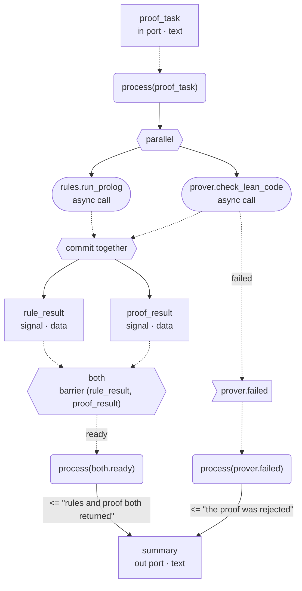

# AWHDL の図示（`aic graph`）

[English](GRAPH.md) | 日本語

> この日本語版を規範文書（正本）とします。英語版は参考訳であり、差異がある場合は日本語版が優先されます。

`aic graph` は、`aic check` を通った AWHDL 設計を人が読める図にします。設計レビュー、構成の説明、デバッグ、
セキュリティレビュー、教育、監査の準備に使います。図は検査済みの AST から導いた**派生ビュー**であり、実行の意味は
定めません。実行の意味は [Runtime 仕様](RUNTIME_SPEC_ja.md) が定めます。

## 使い方

```text
aic graph <file.awhdl>
    [--view structure|behavior|state|petri|security|activity]   既定: structure
    [--format mermaid|dot|json|plantuml|pnml]                    既定: mermaid
    [--output <path|->]                                 既定: -（標準出力）
    [--architecture <name>]      ファイルに architecture が複数あるときに必須
    [--show-classification]      値と流れに機密区分を表示（security ビューでは常に表示）
    [--show-capabilities]        device の generic（route など）を表示
    [--show-policies]            budget と assertion を表示（petri と activity を除く）
    [--show-internal]            どの process も待っていない .done/.failed/.timeout も表示
    [--compact]                  ラベルを 1 行にする。セキュリティ上重要な表示は残す
    [--no-lanes]                 local／cloud のレーン（境界線）を描かない
    [--validate-only]            検査と射影だけを行い、何も書き出さない
```

```bash
cargo run -p conductor-cli -- graph examples/tutorial/05_parallel_barrier.awhdl --view behavior
cargo run -p conductor-cli -- graph tests/graph/secure_development.awhdl --view security --format dot --output security.dot
dot -Tsvg security.dot -o security.svg   # Graphviz がある場合
cargo run -p conductor-cli -- graph tests/graph/secure_development.awhdl --view activity --format plantuml --output activity.puml
cargo run -p conductor-cli -- graph tests/graph/secure_development.awhdl --view petri --format pnml --output net.pnml
```

Mermaid 出力は GitHub などの Markdown にそのまま貼れます。DOT は Graphviz で SVG・PDF に変換できます。JSON は
下記の可視化 IR で、将来の GUI・Web ビューア向けです。PlantUML は activity ビュー（UML アクティビティ図）だけ、
PNML（ISO/IEC 15909-2 の P/T ネット）は petri ビューだけに使えます。PNML は Petri ネットの解析ツールで読み込めます。

## 終了状態

| 値 | 意味 |
|---|---|
| 0 | 成功 |
| 1 | 構文エラー（`AWHDL-E101`） |
| 2 | 構造・Profile のエラー（`E2xx`・`E4xx`） |
| 3 | 情報フローのエラーのみ（`E3xx`） |
| 4 | 射影できない（`AWHDL-G401`。例: state ビュー、architecture の曖昧さ） |
| 5 | 指定した形式でそのビューを表せない（`AWHDL-G501`。例: security ビューを PNML で） |
| 6 | 入出力のエラー（入力を読めない `AWHDL-E001`、出力を書けない `AWHDL-E002`） |

検査に通らない設計は図にしません。不正な設計が正しい設計のように描かれることはありません。

## ビュー

| ビュー | 表すもの |
|---|---|
| `structure` | entity の境界、ポート（境界の外）、信号・timer・barrier（境界の内）、配置ごとの zone に入った device、主なデータの流れ。cloud へ出る流れは太線で示す |
| `behavior` | process、感度（トリガ）、非同期の device 呼び出し、`if` の分岐、`parallel` の fork と「まとめてコミット」する join、barrier、timer、timeout、`.done`/`.failed`/`.timeout` の事象。閉路を作る辺は `retry`（`loop` ラベル）になる |
| `petri` | データを抽象化した P/T ネット。place は小さな円（process の起動、文と文の間、parallel の実行中・終了、barrier のメンバー）、transition は四角（process の開始・終了、代入、呼び出しの成功・失敗・timeout、分岐、fork/join、timer、barrier）で、arc は必ず両者を結ぶ。入力ポートで起動される process の place に初期トークン（●）を置く。事象は、それを待つ process ごとの arc で起動先に届く（ブロードキャストを明示）。`if` の条件と「書き込みで値が変わったか」は選択として表すので、設計のすべての実行がネットの発火列になる（過大近似）。到達可能性・安全性の解析に使える |
| `security` | local／cloud の zone、区分ごとのグループに分けた orchestrator の信号ストア、区分つきの流れ、cloud へ出る流れ（実行時にも検査）、人の承認、そして**拒否される流れ**。拒否は `DENIED` のラベル付きの点線（Mermaid では `-.-x`、DOT では赤の点線と `tee` 矢じり）で、許可された辺と見分けがつく。区分のグループ全体が同じ拒否を受けるときは、グループから1本にまとめて描く（JSON には値ごとの辺が残る） |
| `activity` | UML アクティビティ図。process ごとと barrier ごとに1つのアクティビティを置く。開始 → 感度の事象の受信 → アクション（呼び出し・代入）、`if` の判断とマージ、`parallel` の fork/join の棒、結果ごとの switch → 観測される事象のシグナル送信 → 終了。アクティビティ同士は UML と同じくシグナル名でつながる |
| `state` | 宣言された状態だけを描く。v0.1 Profile には状態型がないため、現在は常に終了状態 4 で拒否する。状態を推測して描くことはしない |

機密解除（`x <= declassify e using d;`）は、区分が下がる唯一の箇所として全ビューで描きます。security ビューでは
紫の太線の `declassified` の辺、petri ビューでは競合する `granted`（薄紫）と `refused` の transition、
activity ビューでは解除の action と granted／refused の分岐になります。例は
`examples/secure_cooperation.awhdl`（ローカル LLM で匿名化し、検査と人の承認を経てクラウドの AI が解析）です。

activity・petri・behavior のビューでは、device の `location` から **レーン**（境界線）を描きます。cloud の
device の呼び出しだけが `cloud (external)` のレーンに入り、それ以外（orchestrator が実行する部分）は
`local (protected)` のレーンに入ります。PlantUML ではスイムレーン、DOT と Mermaid では塗りつぶした枠になり、
境界を越える辺は太線になります。レーンが1つしかない設計では描きません。

色だけに意味を持たせません。線種で区別します: 実線は同期のデータ・制御、破線は非同期・事象、太線は検査付きの境界越え
（cloud へ出る流れ、人の承認）、`x` 付きの点線は拒否です。

`parallel` の join と barrier の辺には `generation_binding = (run_id, correlation_id, generation)` を付けます。
異なる世代の結果が同じ join を満たすことはありません。

## 例（`examples/tutorial/05_parallel_barrier.awhdl`、behavior ビュー）



## 可視化 IR（`--format json`）

```json
{
  "graph_version": "0.1",
  "source_ir_version": "0.1",
  "view": "security",
  "entity": "secure_development",
  "architecture": "hybrid",
  "nodes": [
    {"id": "device:cloud_reviewer", "kind": "device",
     "label": ["cloud_reviewer", "agent · cloud", "clearance internal"],
     "source_ref": {"line": 15, "column": 5, "start": 598, "end": 706},
     "location": "cloud", "device_kind": "agent", "capabilities": {"route": "deep_reasoning"},
     "generation_sensitive": false, "metadata": {"clearance": "internal"}, "group": "zone:cloud"}
  ],
  "edges": [
    {"id": "security_flow:value:note->device:cloud_reviewer", "from": "value:note",
     "to": "device:cloud_reviewer", "kind": "security_flow",
     "label": "public · cloud egress (checked at runtime)", "classification": "public",
     "async": false, "guarded": true, "denied": false, "security_significant": true,
     "metadata": {"crossing": "local -> cloud", "state": "guarded"}}
  ],
  "groups": [{"id": "zone:cloud", "kind": "zone", "label": "cloud zone"}],
  "annotations": ["Derived view of the checked design; it does not define execution semantics."]
}
```

（`tests/graph/secure_development.awhdl` の出力から抜粋）

- ノードの `id` は宣言名とソース上の順序から決まり、ラベルには依存しません（例: `value:task`、`device:coder`、
  `process:2`、`invocation:p2.call1`）。同じ設計からは同じ出力が得られます。
- ノードの種類は仕様の一覧（`entity`・`device`・`process`・`value`・`event`・`invocation`・`timer`・`barrier`・
  `state`・`policy`・`gateway`・`approval`・`declassifier`・`place`・`transition`）に、`decision`（`if`）と
  `fork`（`parallel`）、activity ビュー用の `initial`・`final`・`action`・`accept_event`・`send_signal`・`merge`・
  `join` を加えたものです。辺の種類には `control`（process 内の逐次制御）を加えています。
- `human` 種別の device は `approval` ノード、そこへの流れは `approval_gate` 辺になります。

## 描画の検証

`tools/graph-validate` に、すべての例をすべてのビューと形式で出力し、Mermaid・DOT・PlantUML・PNML・JSON として
解析できるかを検査するスクリプトがあります（`setup.sh` のあと `validate.sh`、`--render` で PNG も作成）。
詳しくは [tools/graph-validate/README_ja.md](../tools/graph-validate/README_ja.md) を参照してください。

## 安全性

すべてのラベルはエスケープします。Mermaid では英数字と一部の記号以外を `#<code>;` の、PlantUML では `&#<code>;` の
文字参照に、DOT では `"`・`\`・改行を、PNML では XML の特殊文字をエスケープします。式や文字列 generic のようにソースから来た文字列が、図の構文として解釈されることはありません。
`--compact` でも、拒否・cloud へ出る流れ・人の承認・timeout・loop のラベルと、security ビューで public 以外の区分を運ぶ流れのラベルは残ります。ノードと辺は省略しません。

## v0.1 Profile での制限

- gateway device は Profile 外のため、cloud への流れは辺の性質（実行時にも検査）として描きます。
- `state` ビューは宣言された状態型が入るまで利用できません。
- `--configuration` は、言語に configuration がないため未対応です。
